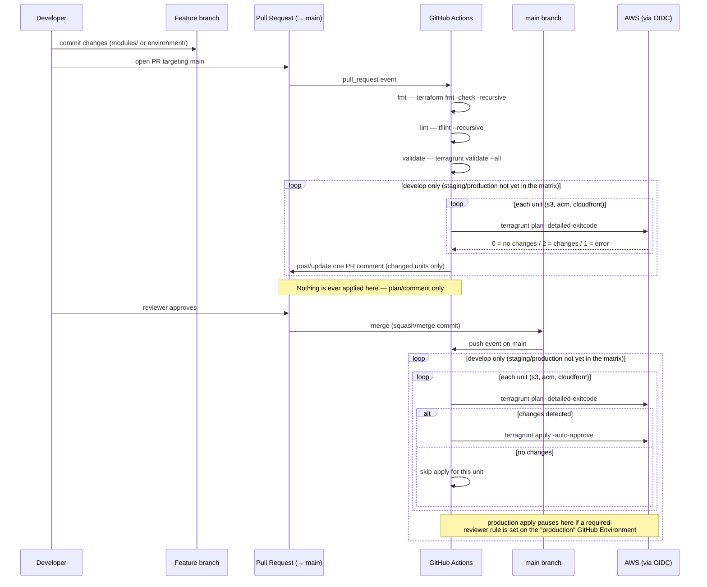

# Secure S3 + CloudFront (Terraform / Terragrunt)

Private, KMS-encrypted, HTTPS-only S3 bucket served through a CloudFront
distribution that only allows requests carrying an approved `Referer` header.
Deployed to `develop`, `staging`, and `production` via Terragrunt, with a
GitHub Actions pipeline authenticated through OIDC (no long-lived AWS keys).

## Repo layout

```
modules/
  s3/          # private, KMS-encrypted, versioned, HTTPS-only bucket
  acm/         # DNS-validated ACM certificate (must run in us-east-1 for CloudFront)
  cloudfront/  # OAC-fronted distribution + referer-check CloudFront Function
environment/
  develop/
    env.hcl              # environment + subdomain locals
    s3/terragrunt.hcl
    acm/terragrunt.hcl
    cloudfront/terragrunt.hcl
  staging/     # same shape as develop
  production/  # same shape as develop
root.hcl       # root Terragrunt config: remote state + generated provider blocks
               # (named root.hcl, not terragrunt.hcl — Terragrunt itself warns
               # that using terragrunt.hcl as the root config name is deprecated)
.github/workflows/terraform.yml
```

Each environment has three independent Terragrunt units (`s3`, `acm`,
`cloudfront`). `cloudfront` depends on the outputs of `s3` and `acm`; `s3` and
`acm` depend on nothing. This one-directional dependency is deliberate — see
"Known limitation" below.

## Required GitHub secrets

| Secret | Status | Purpose |
|---|---|---|
| `AWS_OIDC_ROLE_ARN` | already configured | Role assumed via OIDC for every Terraform/Terragrunt command |
| `AWS_REGION` | already configured | Default AWS region |
| `AWS_ACCOUNT_ID` | already configured | Reference only — Terraform reads the account ID itself via `data "aws_caller_identity"` |
| `TF_STATE_BUCKET` | already configured (`terraform-s3-statefile`) | S3 bucket used for Terraform remote state |
| `DOMAIN_NAME` | **must be added** | Base domain for ACM/CloudFront, e.g. `domainname.com` |
| `HOSTED_ZONE_ID` | **must be added** | Route53 hosted zone ID used for ACM DNS validation |

State locking uses Terraform's native S3 locking (`use_lockfile = true`) —
there is no DynamoDB lock table. This requires **Terraform >= 1.10** on every
machine/runner that runs `terraform`/`terragrunt` against this repo.

## Resource tagging

Every taggable resource carries a standard set of tags, computed in a
`local.standard_tags` block in each module:

| Tag | Meaning |
|---|---|
| `Name` | Resource-specific identifier (bucket name, cert domain, distribution name) |
| `Environment` | `develop` / `staging` / `production` |
| `Managed-By` | Always `terraform` |
| `CreatedBy` | IAM identity ARN that ran the first `apply` (frozen via `lifecycle.ignore_changes`) |
| `CreatedAt` | Timestamp of the first `apply` (frozen via `lifecycle.ignore_changes`) |
| `UpdatedBy` | IAM identity ARN that ran the most recent `apply` |
| `UpdatedAt` | Timestamp of the most recent `apply` |

`CreatedBy`/`CreatedAt` are deliberately excluded from the resource's
`lifecycle.ignore_changes` diff so they stay fixed at their original values;
`UpdatedBy`/`UpdatedAt` are expected to show a diff on every apply — that's
intentional, not a bug.

## CI/CD model

> **Currently scoped to `develop` only.** The workflow's environment matrix is
> `[develop]` in both jobs — `staging` and `production` modules/Terragrunt
> units exist in the repo but the pipeline does not touch them yet. To bring
> an environment online, add it back to the `matrix.environment` list in
> `.github/workflows/terraform.yml` (both the `validate-and-plan` and `apply`
> jobs).

- **Pull requests targeting `main`**: `terraform fmt -check`, `terragrunt
  validate --all`, `tflint`, then a **per-unit** `terragrunt plan
  -detailed-exitcode` for `s3`, `acm`, `cloudfront` in `develop`. The plan
  result is posted/updated as a single PR comment — units with no diff are
  listed as "no changes" (one line, no plan dump); only units with an actual
  diff show their full plan output. Nothing is ever applied from a PR. Note:
  PRs from forks don't receive repo secrets/OIDC on the `pull_request` event
  by default (a GitHub security default) — this job will fail auth for fork
  PRs.
- **Push to `main`** (i.e. a PR merge, assuming `main` is branch-protected
  against direct pushes): for `develop`, each unit (`s3`, `acm`, `cloudfront`)
  is planned individually and **only applied if that unit's plan shows a
  change** — a unit with nothing to change is skipped entirely, never run
  through `apply` just to no-op. The job runs under the GitHub Environment
  named `develop` — add `staging`/`production` back to the matrix (and,
  eventually, a required-reviewer protection rule on the `production`
  Environment) when those are ready to deploy.

## PR → merge flow



## Running locally

From one environment's directory (applies only `s3`, `acm`, `cloudfront` for
that environment, not all three environments):

```bash
export AWS_REGION=...
export TF_STATE_BUCKET=terraform-s3-statefile
export DOMAIN_NAME=domainname.com
export HOSTED_ZONE_ID=...
# authenticate to AWS locally however you normally do (SSO, profile, etc.)

cd environment/develop
terragrunt validate --all
terragrunt plan --all
terragrunt apply --all
```

Note: `--all` applies/plans all three units unconditionally — fine for local,
interactive use. CI does not use `--all` for plan/apply; it loops per unit so
a unit with nothing to change is never touched (see "CI/CD model" above).

## KMS key policy for CloudFront

Because the bucket uses SSE-KMS, the `s3` module sets an explicit key policy
on the KMS key (not just the S3 bucket policy) granting `kms:Decrypt` /
`kms:GenerateDataKey*` to the `cloudfront.amazonaws.com` service principal
(scoped by `AWS:SourceAccount`, for the same circular-dependency reason as the
bucket policy — see below). Without this, CloudFront's OAC requests get a
`KMS.AccessDeniedException` even though the S3 bucket policy allows the read
— the bucket policy alone is not sufficient for KMS-encrypted objects. The key
policy also re-declares full access for the account root user, since setting
any custom `policy` on `aws_kms_key` replaces the default policy entirely.

## CloudFront caching

`modules/cloudfront` owns its own `aws_cloudfront_cache_policy` (not the AWS
managed "CachingOptimized" policy) so `min_ttl` / `default_ttl` / `max_ttl`
are tunable per environment via Terragrunt inputs. No query strings, cookies,
or headers are forwarded into the cache key — the referer-check function runs
at `viewer-request`, before the cache lookup, so it doesn't need `Referer` in
the cache key, and keeping the key minimal maximizes the cache hit ratio for
a static-asset origin. The referer-check function itself can be disabled per
call site via `enable_referer_check = false` if the module is reused
somewhere that doesn't need it.

## Known limitation: account-scoped CloudFront access

CloudFront needs the S3 bucket to exist before it can be created; the S3
bucket policy would ideally reference the CloudFront distribution's ARN, but
that distribution doesn't exist yet when the bucket is first created — a
genuine circular dependency. This repo resolves it by scoping the bucket
policy's CloudFront-access statement to `AWS:SourceAccount` (any CloudFront
distribution in this AWS account) rather than a specific distribution ARN, so
`s3` and `cloudfront` remain independent, non-cyclic Terragrunt units.

If you need to tighten this to a specific distribution later, add a
`dependency "cloudfront"` block to the `s3` unit (referencing
`dependency.cloudfront.outputs.distribution_arn`) once the distribution
already exists, and re-apply.

## Explicitly out of scope

- WAF / Shield in front of CloudFront
- CloudFront access logging bucket
- Per-environment separate AWS accounts/IAM roles (all three environments
  currently share one OIDC role)
- Bootstrapping the state bucket or a DynamoDB lock table (not needed — see
  above)
